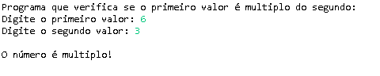

# Multiplos Em Java

## Enunciado

**Escreva um aplicativo que leia dois inteiros, além de determinar se o primeiro é um múltiplo do segundo e imprimir o resultado.**

Autor: Erick Leite Freire 
Criado em: 23-07-2024 
Site: [Erick Freire](https://www.erickfreire.com.br) 
